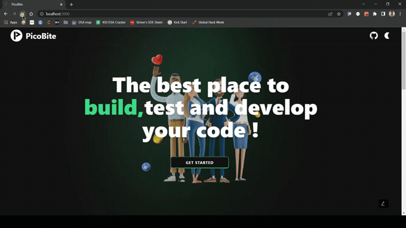
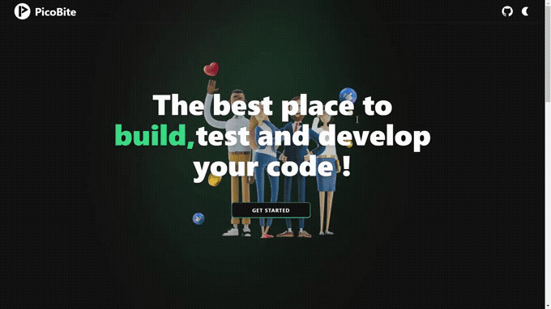
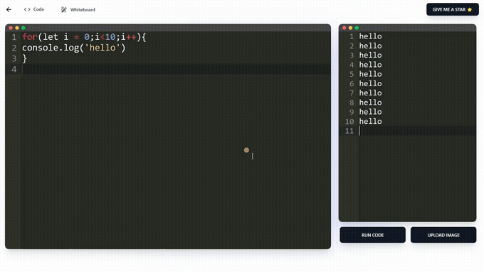

<h3 align="center"><a href="">View the presentaton (1. https://youtu.be/hfEKB3F9YVU [Presentation video] 
 2. https://youtu.be/TYr748KAZmc  [Intro video])</a></h3>

<h2>The problems we address...</h2>

In India, more than 95% of schools don't allow smartphones in class. Being a Computer Science teacher becomes very difficult as it is nearly impossible to check the handwritten code of each student line by line. Also talking in India, in most schools, the students don't have the privilege to have one computer each for them so that they can run their code on their own. So it becomes a nightmare for the teacher as they might have to manually type each code of each student and run it or take the risk of missing out on bugs. So we came up with PicoBite to make this job easier.

Another reason for creating PicoBite was that once we entered college we understood the importance of coding.
So we decided to build a progressive web app because in today's world almost everyone uses a phone. Now they can start coding early and learn from online teachers.

<h2>How it looks:🤩: </h2>

<strong>Landing / Home</strong>

<strong>Image to Code</strong>

<strong>Whiteboard</strong>

<strong>Light Mode</strong>

## Challenges we ran into :🙁:

- Limited API requests (maximum 50 requests)

- Due to limited API fetch requests we can't share the deployment link.

## What we learned 🤓

We are a group of very enthusiastic developers who are open to learning and experimenting with new techs. The thing which is common among us is that we love hackathons 🤩. We got to learn a lot of framer motion animations and used a few in our project too. we learned how to integrate an ML model with web.

## Built With :🛠️:

 
   
   
  
   
  
   
   
   
     
   
